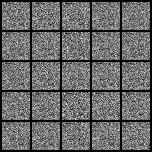
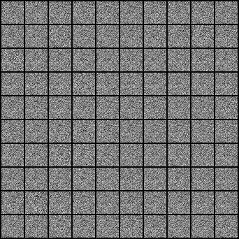

This repository is created to study Generative Model. 
I read the paper and implemented a simple example code.

## Generative Model

### GAN
Generative Adversarial Network
[[Blog]](https://re-code-cord.tistory.com/entry/Generative-Adversarial-Networks) [[Paper]](https://arxiv.org/abs/1406.2661) [[Code]](https://github.com/8639sung/Generative_Model/blob/main/GAN/GAN.ipynb)

    

### CGAN
Conditional Generative Adversarial Network
[[Blog]](-) [[Paper]](https://arxiv.org/abs/1411.1784) [[Code]](https://github.com/8639sung/Generative_Model/blob/main/CGAN/CGAN.ipynb)

    

